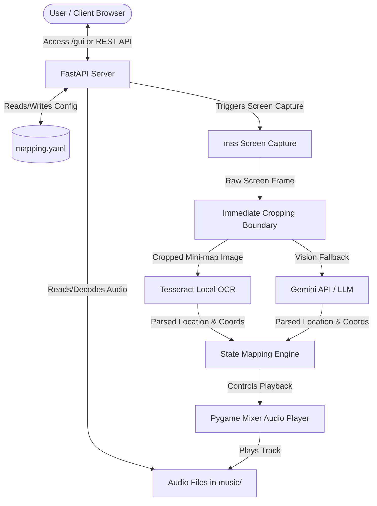

# STRIDE Threat Modeling Assessment: Roving Bard

This document presents a comprehensive threat modeling assessment of the **Roving Bard** music player system based on the STRIDE framework.

---

## 1. System Boundaries and Data Flow Mapping

The Roving Bard system monitors a player's screen in real time to capture location name and coordinates data, mapping this input to trigger music changes. The following diagram illustrates the entry points, processing boundaries, and data storage layers.

### Entry Points
- **REST API Routes (FastAPI)**: Serves routes like `/api/status`, `/api/control`, `/api/config`, `/api/screenshot`, etc.
- **Web GUI (`/gui`)**: Unprotected HTML/JS dashboard interface loaded in the browser.
- **Telemetry System**: Connects optionally to GCP/GCS bucket logging and OpenTelemetry monitoring.

### Data Storage & External Boundaries
- **Playlist Directory (`music/` / `playlist_dir`)**: Folder containing local audio files (`.wav`, `.mp3`, `.ogg`, `.flac`, `.abc`, `.mp4`).
- **Capture Directory (`capture/`)**: Folder containing cached screenshot crops.
- **Configuration (`mapping.yaml`)**: Key-value YAML storage of active coordinate boundaries and bounds configurations.
- **External API Services**: LiteLLM/Gemini endpoints using global environment API keys.

---

## 2. STRIDE Threat Assessment Summary

| STRIDE Pillar | Vulnerability Description | Severity | Threat Target | Mitigation Status |
| :--- | :--- | :--- | :--- | :--- |
| **Spoofing** | Authentication relies on checking `X-API-Key` or query params. If environment variables are empty, unauthenticated calls may bypass check or fail completely. | High | REST API Endpoints | Partially Mitigated |
| **Tampering** | Path traversal sequences (e.g. `../../`) in `track_file` allow reading files outside `music/` playlist folder. | High | `player.py` (`play_track`) | Unmitigated |
| **Repudiation** | Lack of structured audit logging for state-modifying endpoints (`/api/config`, `/api/upload-audio`, `/api/control`). | Medium | Operations Auditing | Unmitigated |
| **Information Disclosure** | Unprotected `/gui` endpoint injects and leaks raw API keys (`AGENT_API_KEY`, `GOOGLE_API_KEY`, `GEMINI_API_KEY`) into the HTML page source. | Critical | `/gui` Route | Unmitigated |
| **Denial of Service** | Unbounded file uploads in `/api/upload-audio` can trigger Out of Memory (OOM) errors or exhaust server storage space. | High | `/api/upload-audio` | Unmitigated |
| **Elevation of Privilege** | If authentication middleware fails or keys are not configured, any network client can trigger administrative actions like uploading file payloads or reading raw configurations. | High | FastAPI Router | Partially Mitigated |

---

## 3. Detailed Threat Assessment

### 👥 Spoofing
- **Description**: Authentication relies on verifying the `X-API-Key` header or `api_key` query parameter against environment variables (`AGENT_API_KEY`, `GOOGLE_API_KEY`, `GEMINI_API_KEY`). If these variables are not configured in the host environment, any unauthenticated agent or user could bypass keys validation.
- **Access to Sensitive Tools**: Bypassing API key checks allows spoofing control commands, enabling full access to system commands (e.g. screenshot trigger, configuration alteration).

### ✏️ Tampering
- **Vulnerability (Path Traversal in Playback)**: The track selection in `play_track()` ([player.py](file:///home/chuubi/Desktop/vibe-coding-2026/capstone/roving-bard/app/player.py#L76)) does not sanitize the `track_file` filename input. If a malicious client passes path traversal sequences (e.g., `../../`), they can reference files outside the designated `music/` playlist folder.
- **Vulnerability (Configuration Tampering)**: The `/api/config` REST endpoint accepts raw bounds and coordinate configurations. If a spoofed command overwrites `mapping.yaml` boundaries, it can disrupt the parsing engine.

### 📝 Repudiation
- **Vulnerability**: While the codebase outputs diagnostic messages to standard output (e.g. `[Playback] Resuming music`), there is no structured audit logging for administrative actions such as configuration changes (`/api/config`), file uploads (`/api/upload-audio`), or manual play/stop triggers.

### 🔍 Information Disclosure
- **CRITICAL Vulnerability (API Key Exposure)**: The `/gui` route ([fast_api_app.py](file:///home/chuubi/Desktop/vibe-coding-2026/capstone/roving-bard/app/fast_api_app.py#L221-L236)) is **completely unprotected** and served without requiring authentication or API key checks. When requested, it reads the active environment keys (`AGENT_API_KEY`, `GOOGLE_API_KEY`, `GEMINI_API_KEY`) and embeds them directly in the served HTML content via `content.replace("{{API_KEY_PLACEHOLDER}}", api_key)`. Any user accessing `/gui` can inspect the page source to leak raw credentials.
- **Vulnerability (Unhandled Stack Traces)**: Upload errors or OCR parsing issues print raw system traceback details directly back to the client or console logs, potentially leaking host path structures and dependencies.

### 💥 Denial of Service (DoS)
- **Vulnerability (Unbounded File Uploads)**: The `/api/upload-audio` route ([fast_api_app.py](file:///home/chuubi/Desktop/vibe-coding-2026/capstone/roving-bard/app/fast_api_app.py#L387-L417)) reads the entire file directly into memory using `file.file.read()` without any limit on the file size. This could trigger Out of Memory (OOM) crashes or exhaust disk space on the host.
- **Vulnerability (Uncapped API Consumption)**: The active screen scan functionality triggers Vision AI queries. If flooded by automated scripts, it can lead to rate-limit lockouts or large unexpected consumption of LLM credits.

### 👑 Elevation of Privilege
- **Vulnerability**: If key management falls back to unconfigured or default states, an unprivileged user on the local network can access administrative routes like `/api/upload-audio` or `/api/config` to upload executable scripts (e.g. as `.mp4` or other accepted extensions) or manipulate core application state.

---

## 4. Actionable Security Recommendations

> [!IMPORTANT]
> To protect secret credentials, **do not serve raw API keys in the client-side JavaScript**. Instead, the backend API should handle authorization tokens or proxy LLM queries.

1. **Protect GUI API Key Injection**:
   - Refactor the frontend `/gui` dashboard to read environment variables from a secure endpoint, or require authentication on the `/gui` route itself.
2. **Implement Path Traversal Sanitization**:
   - Apply `os.path.basename()` to `track_file` parameters inside `SafeMusicPlayer.play_track()` to prevent directory traversal attacks.
3. **Add File Upload Limits**:
   - Enforce a strict file-size limit (e.g., max 50MB) on `/api/upload-audio` and process the file upload in chunks rather than reading it entirely into memory.
4. **Establish Security Audit Logs**:
   - Replace standard `print` statements with structured python logging that logs actor information for critical state-modifying requests.
