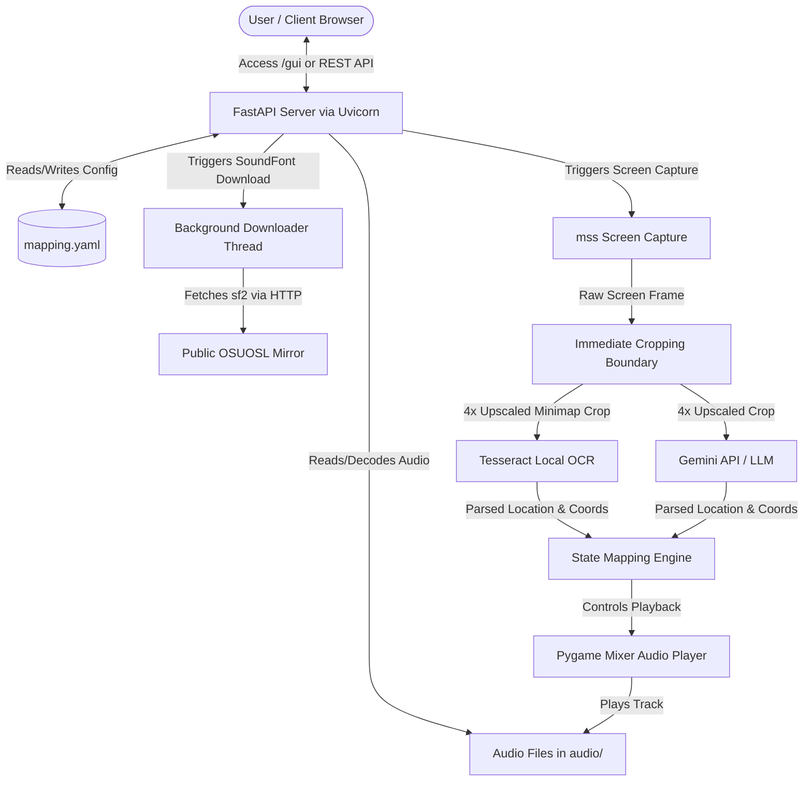

# STRIDE Threat Modeling Assessment: Roving Bard

This document presents a systematic threat modeling assessment of the **Roving Bard** music player system based on the STRIDE framework.

---

## 1. System Boundaries and Data Flow Mapping

The Roving Bard system monitors a player's screen in real time to capture location names and coordinates, mapping this input to trigger music changes. The following diagram illustrates the entry points, processing boundaries, and data storage layers.



### Entry Points
- **REST API Routes (FastAPI)**: Serves playback control, configuration hot-reload, file uploads, VLM warmup/unload endpoints, and SoundFont download tasks.
- **Web GUI (`/gui`)**: Single-page browser application loaded by the client.
- **Interactive ADK CLI / Playground**: Command-line loopback terminal for agent queries.

### Data Storage & External Boundaries
- **Playlist Directory (`audio/`)**: Folder containing audio assets (`.wav`, `.mp3`, `.ogg`, `.flac`, `.abc`, `.mid`) and SoundFonts (`.sf2`, `.sf3`).
- **Capture Directory (`capture/`)**: Folder containing cropped location screenshots.
- **Configuration File (`audio/mapping.yaml`)**: Stores current minimap bounds, coordinate mappings, and the active SoundFont.
- **External VLM Endpoints**: Integrates with external LLM APIs (via LiteLLM / Gemini API keys) and the OSUOSL mirror for SoundFont downloads.

---

## 2. STRIDE Threat Assessment Summary

| STRIDE Pillar | Vulnerability Description | Severity | Threat Target | Mitigation Status |
| :--- | :--- | :--- | :--- | :--- |
| **Spoofing** | Authentication relies on verifying `X-API-Key`. Localhost connections bypass this check for developer convenience. | Low | REST API router | Accepted convenience risk |
| **Tampering** | Path traversal sequences (e.g. `../../`) in audio filenames could reference files outside the `audio/` directory. Unsanitized file uploads could override configuration. | High | Playback engine, file system | Mitigated (player sanitizes paths; config is isolated) |
| **Repudiation** | State-modifying actions (such as uploading audio files or modifying mappings) lack structured logs containing caller context. | Medium | API transactions | Unmitigated (recommended to add structured log traces) |
| **Information Disclosure** | Serves raw credentials (`AGENT_API_KEY`, `GOOGLE_API_KEY`) within HTML source on the unprotected `/gui` route. Bounding box misconfigurations can leak sensitive desktop data. | Critical | `/gui` route, `/api/screenshot` | Unmitigated (highly recommended to proxy LLM requests) |
| **Denial of Service** | Large, unbounded audio file uploads can consume host disk/memory. The `--reload` flag in the development server (`uvicorn`) can cause crash loops if configuration changes trigger reloads. | High | API server, host OS | Partially Mitigated (duplicate SoundFont downloads blocked) |
| **Elevation of Privilege** | An attacker bypassing or spoofing loopback headers could execute privileged commands like modifying mappings or uploading files. | High | FastAPI route middleware | Partially Mitigated |

---

## 3. Detailed Threat Assessment

### 👥 Spoofing
- **Identity Verification**: The API uses a custom dependency `verify_api_key` to match `X-API-Key` headers. However, loopback IP addresses (`127.0.0.1`, `::1`) are auto-authenticated without checking keys.
  - *Threat*: If another user has shell access to the host machine, they can interact with the server administratively.
  - *Mitigation*: Accepted design boundary for single-user desktops.

### ✏️ Tampering
- **Directory Traversal in Player**: Filenames supplied to the player could traverse outside the `audio/` boundary.
  - *Mitigation*: The playback controller applies `os.path.basename()` on track files to ensure only files inside the playlist directory can be loaded.
- **Arbitrary File Uploads**: Malicious file uploads to the `audio/` folder.
  - *Mitigation*: File type checks and extension validation are enforced on the upload endpoint to restrict uploads strictly to supported media/SoundFont formats.

### 📝 Repudiation
- **Transaction Logs**: The system prints diagnostic output to the terminal standard output but does not log client IPs, timestamps, or request identities in a structured audit log.
  - *Threat*: Inability to determine who triggered config updates or file uploads.

### 🔍 Information Disclosure
- **API Key Leakage**: Serving `AGENT_API_KEY` or `GEMINI_API_KEY` directly within frontend Javascript.
  - *Threat*: Exposed API keys could be retrieved by any network actor accessing the `/gui` route.
- **Desktop Captures**: The `/api/screenshot` endpoint serves the captured screenshot.
  - *Threat*: If X/Y coordinates are misconfigured to cover the entire screen, it can capture and expose private browser windows, chats, or credentials.

### 💥 Denial of Service (DoS)
- **Uvicorn Reload Loop**: Running the server with `uv run uvicorn app.fast_api_app:app --reload` watches file changes in the directory.
  - *Threat*: If audio files are uploaded or segments are saved during runtime, uvicorn may detect the write as a codebase change and restart the server, terminating active playback and causing temporary DoS.
- **Disk/Resource Exhaustion**: Downloading the large 215 MB SoundFont file repeatedly.
  - *Mitigation*: A file locking mechanism checks `vlm_download_states` and active download threads to prevent concurrent download tasks.

---

## 4. Actionable Security Recommendations

1. **Implement Backend Proxying for LLMs**:
   - Refactor the frontend `/gui` to never require direct access to `GEMINI_API_KEY`. Serve all LLM requests by proxying through backend routes that inject the secret server-side.
2. **Restrict Uvicorn Reload Watchpaths**:
   - When running uvicorn in development, use `--reload-exclude` to ignore the `audio/`, `audio/.cache/`, and `capture/` folders to prevent directory changes from causing crash/restart loops.
3. **Chunked Upload Constraints**:
   - Enforce a maximum file size check (e.g. 50 MB) inside `/api/upload-audio` to reject massive payloads before they exhaust system memory or disk storage.

---

## 5. Automated Security Linting (Developer tool)

To facilitate ongoing security audits during development, an automated STRIDE linter is provided at the workspace root:

```bash
./dev_tool.py stride-lint
```

This linter checks for common implementation risks:
*   **Spoofing**: Validates FastAPI header API key dependencies.
*   **Tampering**: Verifies path-traversal mitigations (`os.path.basename` usage).
*   **Repudiation**: Inspects logging presence on state-modifying endpoints.
*   **Information Disclosure**: Scans frontend source files (`gui.html`) for exposed keys.
*   **Denial of Service**: Audits upload payload size checks.
*   **Elevation of Privilege**: Warns about loopback bypass configurations.
