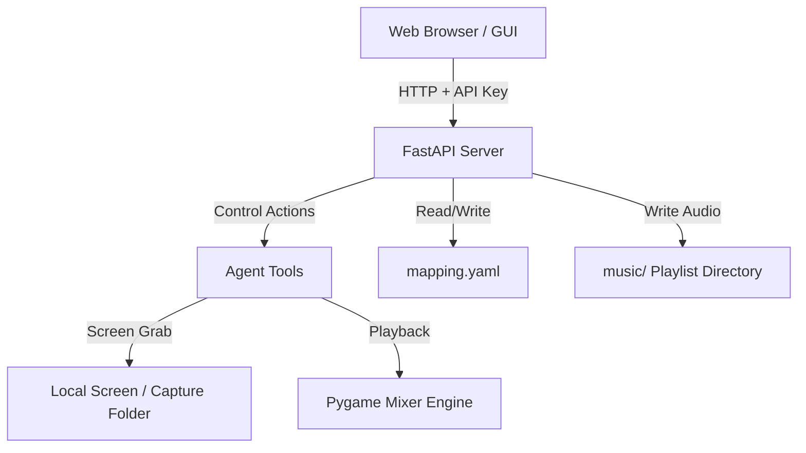

# STRIDE Threat Model Assessment: Roving Bard

This document outlines the security boundaries, potential threat vectors, and mitigation strategies for the **Roving Bard (Game-Aware Music Player Agent)** project using the STRIDE threat modeling framework.

---

## 🔍 System Boundaries & Data Flow

Roving Bard consists of three main components running locally:
1.  **FastAPI Web Server (`fast_api_app.py`)**: Serves the control panel GUI and exposes control APIs.
2.  **Music Player Engine (`player.py` / `tools.py`)**: Captures screen content, performs OCR/Vision checks, and controls Pygame audio playback.
3.  **Local Storage Layer**: Includes configuration files (`mapping.yaml`), local captures (`capture/`), and local audio files (`music/`).

---

## 🛡️ STRIDE Threat Analysis

### 1. Spoofing (Identity Verification)
*   **Threat**: An unauthenticated user spoofing requests to control the music player, configuration, or view screen captures.
*   **Analysis**: 
    *   The API endpoints require an API key passed via the `X-API-Key` header or `api_key` query parameter.
    *   Accepted keys are pulled from host environment variables (`AGENT_API_KEY`, `GOOGLE_API_KEY`, or `GEMINI_API_KEY`).
*   **Risk**: Low (as long as strong environment keys are used and server binds to `127.0.0.1`).
*   **Mitigation**: Always run the application bound to `localhost` (127.0.0.1) to prevent exposure over local networks. Ensure environment variables are not committed to Git.

### 2. Tampering (Data Manipulation)
*   **Threat A**: Arbitrary file uploads writing files outside the designated `music/` directory (Path Traversal).
*   **Analysis**: The `api_upload_audio` endpoint uses `os.path.basename(file.filename)` to sanitize filenames, which blocks basic traversal patterns like `../../filename.wav`.
*   **Threat B**: Malicious configuration overrides via `POST /api/config`.
*   **Analysis**: An attacker with API key access can rewrite `mapping.yaml` to specify absolute paths or modify system polling rates.
*   **Mitigation**:
    *   Strictly check that the destination directory in `api_upload_audio` resolves inside the intended `music` playlist folder.
    *   Validate configuration values (e.g., boundaries, interval sizes) in `/api/config` before writing them to disk.

### 3. Repudiation (Traceability & Logging)
*   **Threat**: Inability to trace system actions, unauthorized playback requests, or configurations updates.
*   **Analysis**: 
    *   The application prints basic log statements to standard output for playback transitions, configuration loads, and errors.
    *   User feedback is logged via Google Cloud Logging (`app_logger.log_struct`).
*   **Mitigation**: Implement a structured file-based log (e.g. using Python's `logging.handlers.RotatingFileHandler`) to persist audit logs for configuration edits and upload actions.

### 4. Information Disclosure (Data Leakage)
*   **Threat**: Desktop privacy leaks via screen capture sharing.
*   **Analysis**:
    *   While the OCR scanner crops the capture immediately for privacy, the `/api/screenshot` endpoint serves the **full, uncropped screen capture** cached in memory (`latest_screenshot_bytes`) to the front-end.
    *   If a user leaves sensitive information open on their screen during a scan, it will be cached and readable via the API.
*   **Mitigation**:
    *   Avoid caching the full monitor capture in `latest_screenshot_bytes` if privacy is a concern. Crop the image immediately upon capture/load before saving it to the cache.
    *   Restrict the GUI preview to only display the cropped bounding box rather than the entire desktop screen.

### 5. Denial of Service (DoS)
*   **Threat A**: Overloading LLM quota and triggering high costs via rapid scans.
*   **Analysis**: If OCR fails, the system automatically falls back to Gemini Multimodal Vision via LiteLLM. A loop of rapid requests to `POST /api/control?action=scan` could result in rapid API consumption, exceeding quotas or raising host costs.
*   **Threat B**: Disk space exhaustion through large audio file uploads.
*   **Analysis**: The `api_upload_audio` endpoint does not restrict the upload file size.
*   **Mitigation**:
    *   Apply a rate-limiter or minimum interval check between screen scans.
    *   Add a maximum file size limit (e.g., 20MB) to the FastAPI upload handler.

### 6. Elevation of Privilege
*   **Threat**: A low-privilege network attacker gaining system-level control.
*   **Analysis**: The app runs locally as the executing user. Since it allows writing configuration files and uploading audio formats (which are loaded by Pygame), there is minimal risk of system privilege escalation unless a vulnerability in Pygame's underlying C-libraries or Python parser is exploited.
*   **Mitigation**: Keep dependencies (`pygame`, `fastapi`, `pillow`) up to date. Run the process inside a container or as a non-root user when deployed.
