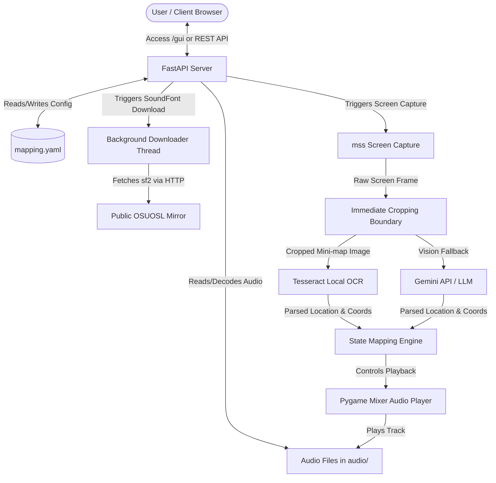

# STRIDE Threat Modeling Assessment: Roving Bard

This document presents a systematic threat modeling assessment of the **Roving Bard** music player system based on the STRIDE framework.

---

## 1. System Boundaries and Data Flow Mapping

The Roving Bard system monitors a player's screen in real time to capture location name and coordinates data, mapping this input to trigger music changes. The following diagram illustrates the entry points, processing boundaries, and data storage layers.

### Entry Points
- **REST API Routes (FastAPI)**: Serves routes like `/api/status`, `/api/control`, `/api/config`, `/api/screenshot`, and `/api/soundfont/download`.
- **Web GUI (`/gui`)**: Unprotected HTML/JS dashboard interface loaded in the browser.
- **Telemetry System**: Connects optionally to GCP/GCS bucket logging and OpenTelemetry monitoring.

### Data Storage & External Boundaries
- **Playlist Directory (`audio/` / `playlist_dir`)**: Folder containing local audio files (`.wav`, `.mp3`, `.ogg`, `.flac`, `.abc`, `.mid`, `.sf2`, `.sf3`).
- **Capture Directory (`capture/`)**: Folder containing cached screenshot crops.
- **Configuration (`mapping.yaml`)**: Key-value YAML storage of active coordinate boundaries, bounds configurations, and active SoundFont selection.
- **External API Services**: LiteLLM/Gemini endpoints using global environment API keys.
- **SoundFont Download Mirror**: Public OSUOSL mirror (`osuosl.org`) used to fetch `MuseScore_General.sf2` on-demand.

---

## 2. STRIDE Threat Assessment Summary

| STRIDE Pillar | Vulnerability Description | Severity | Threat Target | Mitigation Status |
| :--- | :--- | :--- | :--- | :--- |
| **Spoofing** | Authentication relies on checking `X-API-Key`. Localhost loopback connections (`127.0.0.1`, `::1`, `localhost`) bypass this check for convenience. | Low | REST API Endpoints | Accepted Convenience Risk |
| **Tampering** | Path traversal sequences (e.g. `../../`) in `track_file` allow referencing files outside `audio/` playlist folder. Lack of file extension validation in `/api/upload-audio` allows uploading arbitrary file types. | High | `player.py` (`play_track`), `/api/upload-audio` | Unmitigated |
| **Repudiation** | Lack of structured audit logging for state-modifying endpoints (`/api/config`, `/api/upload-audio`, `/api/control`). | Medium | Operations Auditing | Unmitigated |
| **Information Disclosure** | Unprotected `/gui` endpoint injects and leaks raw API keys (`AGENT_API_KEY`, `GOOGLE_API_KEY`, `GEMINI_API_KEY`) into the HTML page source. Bounding box misconfigurations in `/api/screenshot` can expose sensitive desktop data. | Critical | `/gui` Route, `/api/screenshot` | Unmitigated |
| **Denial of Service** | Unbounded file uploads in `/api/upload-audio` or repeated trigger of the 215 MB SoundFont downloader can exhaust disk space or memory. | High | `/api/upload-audio`, `/api/soundfont/download` | Partially Mitigated |
| **Elevation of Privilege** | If authentication middleware fails or keys are not configured, any network client can trigger administrative actions like uploading file payloads or reading raw configurations. | High | FastAPI Router | Partially Mitigated |

---

## 3. Detailed Threat Assessment

### 👥 Spoofing
- **Description**: Authentication relies on verifying the `X-API-Key` header or `api_key` query parameter against environment variables. If these variables are not configured, unauthenticated clients could bypass checks.
- **Localhost Bypass**: To simplify local developer setup, clients connecting via loopback (`127.0.0.1`, `::1`, or `localhost`) are automatically authenticated.
  - *Threat*: On a shared multi-user machine, another local user could control the player or modify configuration.
  - *Mitigation*: This is an accepted design choice for single-user local machines. Remote network clients are still.

### ✏️ Tampering
- **Vulnerability (Path Traversal in Playback)**: The track selection in `play_track()` does not sanitize the `track_file` filename input. If a malicious client passes path traversal sequences, they can reference files outside the designated `audio/` playlist folder.
- **Vulnerability (Unvalidated File Uploads)**: The `/api/upload-audio` endpoint does not validate file extensions or MIME types. A user could upload executable scripts or configuration files to the `audio/` directory.
  - *Threat*: Could lead to remote code execution (RCE) if combined with a local file inclusion or directory traversal exploit.
- **Vulnerability (Configuration Tampering)**: The `/api/config` REST endpoint accepts raw bounds and coordinate configurations. If a spoofed command overwrites `mapping.yaml` boundaries, it can disrupt the parsing engine.
- **Cache Invalidation (Safe Deletion)**: Changing the SoundFont triggers a deletion of all `.flac` files in `audio/.cache/`.
  - *Mitigation*: The path is hardcoded to the `.cache` subdirectory, and only files ending with `.flac` are deleted, preventing arbitrary deletion.

### 📝 Repudiation
- **Vulnerability**: While the codebase outputs diagnostic messages to standard output (e.g. `[Playback] Resuming music`), there is no structured audit logging for administrative actions such as configuration changes (`/api/config`), file uploads (`/api/upload-audio`), or manual play/stop triggers.

### 🔍 Information Disclosure
- **CRITICAL Vulnerability (API Key Exposure)**: The `/gui` route is served without requiring authentication. When requested, it reads the active environment keys and embeds them directly in the served HTML content. Any user accessing `/gui` can inspect the page source to leak raw credentials.
- **Vulnerability (Sensitive Desktop Data Leakage)**: The `/api/screenshot` endpoint returns the cropped screenshot of the minimap.
  - *Threat*: If the bounding box coordinates are misconfigured (e.g., set to cover the entire screen), the endpoint could capture and expose sensitive desktop windows, personal chat logs, or credentials.
- **Vulnerability (Unhandled Stack Traces)**: Upload errors or OCR parsing issues print raw system traceback details directly back to the client or console logs, potentially leaking host path structures and dependencies.

### 💥 Denial of Service (DoS)
- **Vulnerability (Unbounded File Uploads)**: The `/api/upload-audio` route reads the entire file directly into memory using `file.file.read()` without any limit on the file size. This could trigger Out of Memory (OOM) crashes or exhaust disk space on the host.
- **Downloader Resource Exhaustion**: The `/api/soundfont/download` endpoint downloads a 215 MB file.
  - *Threat*: Repeatedly calling this endpoint could exhaust disk space or bandwidth.
  - *Mitigation*: The backend prevents concurrent duplicate downloads by checking if a download thread is already active.
- **SSRF (Server-Side Request Forgery)**:
  - *Mitigation*: The download URL is hardcoded on the backend (`https://osuosl.org/pub/musescore/...`). Users cannot supply arbitrary URLs, which completely eliminates SSRF risks.

### 👑 Elevation of Privilege
- **Vulnerability**: If key management falls back to unconfigured or default states, an unprivileged user on the local network can access administrative routes like `/api/upload-audio` or `/api/config` to upload file payloads or manipulate core application state.

---

## 4. Actionable Security Recommendations

> [!IMPORTANT]
> To protect secret credentials, **do not serve raw API keys in the client-side JavaScript**. Instead, the backend API should handle authorization tokens or proxy LLM queries.

1. **Protect GUI API Key Injection**:
   - Refactor the frontend `/gui` dashboard to read environment variables from a secure endpoint, or require authentication on the `/gui` route itself.
2. **Implement Path Traversal Sanitization**:
   - Apply `os.path.basename()` to `track_file` parameters inside `SafeMusicPlayer.play_track()` to prevent directory traversal attacks.
3. **Restrict File Upload Types and Sizes**:
   - Enforce a strict file-size limit (e.g., max 50MB) on `/api/upload-audio` and process the file upload in chunks.
   - Restrict uploaded file extensions strictly to allowed audio formats (`.wav`, `.mp3`, `.ogg`, `.flac`, `.mp4`, `.abc`, `.mid`, `.midi`, `.sf2`, `.sf3`).
4. **Establish Security Audit Logs**:
   - Replace standard `print` statements with structured python logging that logs actor information for critical state-modifying requests.
